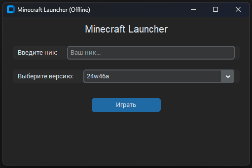

# Minecraft Offline Launcher

**Minecraft Offline Launcher** is a custom launcher for Minecraft that allows players to run Minecraft offline, without needing to sign in with a Microsoft account. The launcher provides a simple and user-friendly graphical interface for selecting the game version and launching Minecraft.

This launcher allows users to choose any installed version of Minecraft and launch the game without connecting to Microsoft servers, providing convenience and ease of use.

## Features

- **Offline Mode**: The launcher does not require a Microsoft account to run the game. Ideal for users who want to play without connecting to online services.
- **Version Selection**: The launcher allows you to select any installed version of Minecraft before launching the game.
- **GUI**: The launcher uses **Tkinter** and **CustomTkinter** for a modern and convenient user interface.
- **Single-file Compilation**: The launcher can be compiled into a single `.exe` file for Windows for easy distribution and use.
- **Ease of Use**: The launcher is configured to automatically perform all the necessary steps to launch the game.

## Screenshots

  
_Example of the launcher interface_

## Installation

### Requirements

To run this launcher, you will need:

- **Python 3.11 or higher**
- **Required libraries**:
  - `customtkinter`
  - `minecraft-launcher-lib`
  - `tkinter`
  - `Pillow`

### Installing Dependencies

To install all necessary dependencies, run the following command in your terminal:

```bash
pip install customtkinter minecraft-launcher-lib Pillow
```

### How to Use

1. Download or clone the repository to your computer.
2. Make sure you have Python installed and all dependencies.
3. Open the project folder in your terminal or command line and run the following command:

   ```bash
   python Launcher.py
   ```

4. In the launcher, select the desired version of Minecraft, enter your offline username, and click **"Launch"**.

5. The launcher will automatically configure Minecraft to run in offline mode.

## Compiling to .exe (Windows)

If you want to compile the launcher into an executable file for Windows, run the following command using **PyInstaller**:

```bash
pyinstaller --onefile --noconsole --hidden-import=tkinter --hidden-import=customtkinter --hidden-import=Pillow --hidden-import=minecraft_launcher_lib --icon=icon.ico Launcher.py
```

This command will create an executable `.exe` file in the `dist` folder.

#### PyInstaller Options:
- **`--onefile`**: Bundles everything into a single `.exe` file.
- **`--noconsole`**: Hides the console window on startup if the GUI is used.
- **`--hidden-import`**: Informs PyInstaller about additional modules that should be included in the build.
- **`--icon=icon.ico`**: Sets an icon for the `.exe` file.

## Problems and Solutions

1. **Minecraft won't start**:
   - Ensure Minecraft and all necessary files are properly set up. You can check the settings and the path to your Minecraft folder.
   
2. **Error compiling with PyInstaller**:
   - Make sure you have installed all the libraries correctly and are using the appropriate options when compiling.
   - Use the `--hidden-import` flag for any additional libraries that might not be automatically detected.

3. **Issue with `customtkinter` library**:
   - Make sure you installed the library with `pip install customtkinter`. If you experience problems, try updating the library to the latest version.

## License

This project is distributed under the MIT license.
